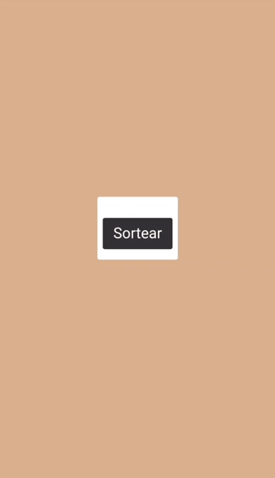

<h1 align="center">SorteadorNumeros</h1>
<p align="center">Fiz um sorteador de números, aperte o botão e receba um.</p> 

# 👨🏻‍💻 O que usei
  
=
# 💻 Tela do projeto
<p align="center">

</p>

<p align="center">
   Link do projeto: https://matheusnsilvab.github.io/SorteadorNumeros/
</p>

# 🚀 Comandos de instalação
```
git clone https://github.com/matheusnsilvab/SorteadorNumeros.git
cd SorteadorNumeros
```